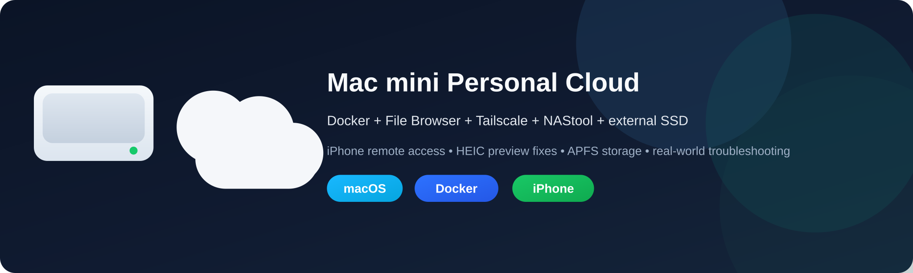
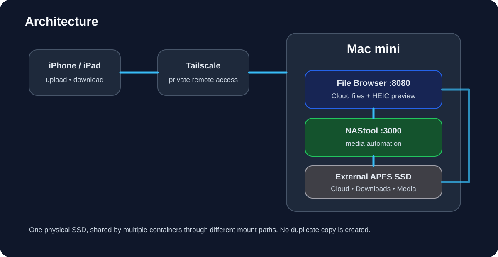
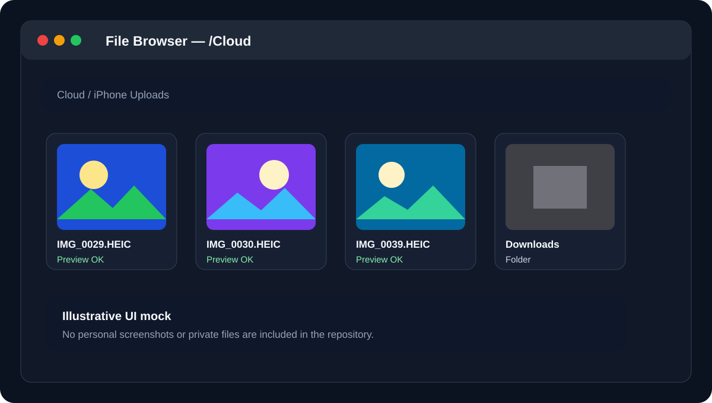

<p align="center">
  
</p>

<p align="center">
  <strong>Türkçe</strong> • <a href="README_EN.md">English</a>
</p>

<p align="center">
  
  
  
  
  
</p>

# Mac mini Personal Cloud

Mac mini + harici NVMe SSD + Docker + File Browser + Tailscale + NAStool ile kişisel bulut ve medya depolama sistemi.

Bu repo sadece “çalışan son ayarları” değil, gerçek kurulum sırasında yaşanan sorunları, yanlış denemeleri, teşhis adımlarını ve geri dönüş yöntemlerini de belgeler. Hedef; iPhone’dan ev dışındayken Mac mini’ye bağlı SSD’ye güvenli şekilde dosya yüklemek/indirmek, HEIC fotoğraflarını düzgün önizlemek ve aynı fiziksel diski NAStool tarafında medya depolaması olarak kullanmaktır.

> Test ortamı: Apple Silicon Mac mini + harici 1 TB NVMe SSD. Donanım markası zorunlu değildir; disk adı, yollar ve portlar sizde farklı olabilir.

## Neler var?

- iPhone/iPad’den hücresel internet üzerinden uzak dosya erişimi
- File Browser ile yükleme, indirme, klasör oluşturma ve silme
- Tailscale ile router portu açmadan özel ağ erişimi
- Tek fiziksel SSD’yi File Browser ve NAStool ile ortak kullanma
- macOS’ta NTFS read-only probleminin teşhisi ve APFS’e geçiş
- iPhone HEIC dosyalarında siyah / yarım / siyah-beyaz preview sorununun çözümü
- FFmpeg + macOS `sips` ile HEIC karşılaştırmalı test akışı
- stale preview/cache teşhisi için HTTP `200` / `304` karşılaştırması
- NAStool için daha güvenli DOM tabanlı Türkçe arayüz yaklaşımı
- yedekleme, geri dönüş ve troubleshooting dokümantasyonu

## Mimari

<p align="center">
  
</p>

File Browser ve NAStool aynı fiziksel SSD’yi farklı container yollarından görür. Dosyalar iki kez kopyalanmaz.

## Görsel örnek

<p align="center">
  
</p>

> Bu görsel gerçek kişisel fotoğraflar yerine güvenli bir UI mock kullanır. Repo içinde özel fotoğraf, Tailscale IP’si, parola veya API anahtarı bulunmaz.

## Hızlı başlangıç

```bash
git clone https://github.com/sykenix/mac-mini-personal-cloud.git
cd mac-mini-personal-cloud
cp .env.example .env
cp filebrowser/config.example.yaml filebrowser/config.yaml
mkdir -p filebrowser/data
chmod +x scripts/*.sh
```

`.env` içindeki SSD yolunu kendi sisteminize göre düzenleyin:

```dotenv
SSD_PATH=/Volumes/Crucial T500
NASTOOL_PORT=3000
FILEBROWSER_PORT=8080
TZ=Europe/Istanbul
```

Klasörleri oluşturun:

```bash
./scripts/create-storage-folders.sh "/Volumes/Crucial T500"
```

Docker servislerini başlatın:

```bash
docker compose up -d
```

Kontrol:

```bash
docker ps --format 'table {{.Names}}\t{{.Image}}\t{{.Ports}}'
```

Yerel adresler:

- File Browser: `http://localhost:8080`
- NAStool: `http://localhost:3000`

İlk girişten sonra yönetici parolalarını mutlaka değiştirin.

## 1. SSD’yi hazırlama

Önce bağlı diskleri görün:

```bash
ls /Volumes
```

Dosya sistemini ve yazılabilirliği kontrol edin:

```bash
diskutil info "/Volumes/Crucial T500" | grep -E "File System|Type \(Bundle\)|Read-Only|Writable"
```

Gerçek kurulumda ilk disk NTFS idi ve macOS tarafından read-only mount edildi:

```text
File System Personality: NTFS
Volume Read-Only: Yes
```

Bu durumda File Browser okuyabilir ama klasör oluşturamaz, dosya silemez veya upload yapamaz. Mac’e sürekli bağlı disk için APFS’e geçildi. Formatlama tüm verileri siler; önce yedek alın.

Ayrıntı: [docs/01-storage-apfs.md](docs/01-storage-apfs.md)

## 2. File Browser ve HEIC desteği

Bu rehber FFmpeg içeren `gtstef/filebrowser` image’ını kullanır. HEIC preview desteği `filebrowser/config.yaml` içinde açıkça etkinleştirilir:

```yaml
integrations:
  media:
    ffmpegPath: "ffmpeg"
    convert:
      imagePreview:
        heic: true
        jpeg: true
```

Ayrıntı: [docs/04-filebrowser.md](docs/04-filebrowser.md)

## 3. iPhone’dan uzaktan erişim

Mac ve iPhone’a Tailscale kurup aynı tailnet’e bağlanın. Önce File Browser’ın yerel ağda çalıştığını doğrulayın. Daha sonra iPhone’da Wi‑Fi’yi kapatıp hücresel veri üzerinden test edin.

Bu yaklaşımda File Browser portunu router’dan genel internete açmanız gerekmez.

Ayrıntı: [docs/05-tailscale-ios.md](docs/05-tailscale-ios.md)

## 4. HEIC siyah / yarım / siyah-beyaz görünüyorsa

Gerçek kurulumda bazı iPhone HEIC dosyaları bozuk preview üretiyordu. Sorunun dosyada mı yoksa cache’te mi olduğunu ayırmak için şu sıra kullanıldı:

1. Aynı HEIC’i container içindeki FFmpeg ile manuel JPEG’e çevir.
2. Aynı dosyayı macOS `sips` ile JPEG’e çevir.
3. İki çıktı da düzgünse orijinal HEIC’in bozuk olmadığını doğrula.
4. Aynı HEIC’i `_TEST` gibi yeni bir adla kopyala.
5. File Browser loglarında eski ve yeni preview isteklerini karşılaştır.
6. Eski dosya `304`, yeni kopya `200` dönüyor ve yeni kopya düzgün görünüyorsa stale preview/cache ihtimali güçlenir.
7. Preview cache’ini temizleyip browser’da hard refresh yap.

FFmpeg testi:

```bash
docker exec filebrowser ffmpeg -y \
  -i "/srv/Cloud/IMG_0030.HEIC" \
  -frames:v 1 \
  "/srv/Cloud/ffmpeg-0030.jpg"
```

macOS karşılaştırması:

```bash
sips -s format jpeg \
  "/Volumes/Crucial T500/Cloud/IMG_0030.HEIC" \
  --out "/Volumes/Crucial T500/Cloud/mac-test.jpg"
```

Cache temizleme:

```bash
./scripts/clear-heic-cache.sh
```

Belirli bir HEIC için preview yenileme:

```bash
./scripts/refresh-heic-preview.sh "/Volumes/Crucial T500/Cloud/IMG_0030.HEIC"
```

Tam teşhis akışı: [docs/06-heic-preview-fix.md](docs/06-heic-preview-fix.md)

## 5. NAStool

NAStool aynı SSD’yi container içinde `/media` olarak görür:

```text
Host:    /Volumes/Crucial T500/Media/Filmler
NAStool: /media/Media/Filmler
```

NAStool kurulumu ve legacy proje notları: [docs/03-nastool.md](docs/03-nastool.md)

## 6. NAStool Türkçe arayüzü

Kaynak dosyalarda geniş global string replacement yapmak riskli çıktı. Kısa Çince stringler uygulama mantığındaki metinleri de etkileyebildiği için karışık UI oluşabiliyor.

Bu nedenle repoda görünür DOM metinlerini çeviren daha güvenli bir installer bulunuyor:

```bash
docker exec -i nas-tools python3 - < nastool/nastool_tr_dom_installer.py
docker restart nas-tools
```

Ardından tarayıcıda hard refresh yapın.

Ayrıntı: [docs/08-nastool-turkish-ui.md](docs/08-nastool-turkish-ui.md)

## 7. Güvenlik

- File Browser ve NAStool portlarını router üzerinden doğrudan genel internete açmayın.
- Uzak erişim için bu rehber Tailscale kullanır.
- `.env`, uygulama veritabanları, API anahtarları, gerçek özel ağ adresleri ve parolaları GitHub’a eklemeyin.
- NAStool upstream projesi arşivlenmiştir; legacy yazılım olarak değerlendirin.

Bkz. [SECURITY.md](SECURITY.md).

## 8. Yedek ve geri dönüş

Çalışan sistemi değiştirmeden önce geri dönüş noktası oluşturun. Özellikle compose, NAStool config, File Browser data ve patched NAStool web ağacını yedekleyin.

Ayrıntı: [docs/07-backup-restore.md](docs/07-backup-restore.md)

## 9. Troubleshooting

Bu repo aşağıdaki gerçek sorunları da belgeler:

- YAML’ın zsh komutu gibi yapıştırılması
- NTFS diskin macOS’ta read-only mount edilmesi
- Docker bind mount izinleri
- HEIC preview cache problemi
- `docker logs -f` komutunun Terminal’i “donmuş” gibi göstermesi
- NAStool global kaynak çevirisinin UI stringlerini bozması
- çalışan sistemi temizleme amacıyla yapılan gereksiz değişikliğin geri alınması

Bkz. [docs/09-troubleshooting.md](docs/09-troubleshooting.md) ve [docs/10-lessons-learned.md](docs/10-lessons-learned.md).

## Yardımcı scriptler

```text
scripts/
├── backup-nastool-web.sh
├── clear-heic-cache.sh
├── create-storage-folders.sh
├── diagnose-storage.sh
├── refresh-heic-preview.sh
└── verify-stack.sh
```

Storage teşhisi:

```bash
./scripts/diagnose-storage.sh "/Volumes/Crucial T500"
```

Stack kontrolü:

```bash
./scripts/verify-stack.sh
```

## Dokümantasyon

| Dosya | Konu |
|---|---|
| [01-storage-apfs.md](docs/01-storage-apfs.md) | SSD, NTFS ve APFS |
| [02-docker-desktop.md](docs/02-docker-desktop.md) | Docker Desktop ve mount’lar |
| [03-nastool.md](docs/03-nastool.md) | NAStool kurulumu |
| [04-filebrowser.md](docs/04-filebrowser.md) | File Browser kurulumu |
| [05-tailscale-ios.md](docs/05-tailscale-ios.md) | iPhone / Tailscale uzak erişim |
| [06-heic-preview-fix.md](docs/06-heic-preview-fix.md) | HEIC preview teşhisi ve çözümü |
| [07-backup-restore.md](docs/07-backup-restore.md) | Yedek ve geri dönüş |
| [08-nastool-turkish-ui.md](docs/08-nastool-turkish-ui.md) | Türkçe NAStool arayüzü |
| [09-troubleshooting.md](docs/09-troubleshooting.md) | Sorun giderme |
| [10-lessons-learned.md](docs/10-lessons-learned.md) | Kurulumdan çıkarılan dersler |

## Sürüm

İlk kararlı yayın için notlar: [RELEASE_NOTES_v1.0.0.md](RELEASE_NOTES_v1.0.0.md)

Değişiklik geçmişi: [CHANGELOG.md](CHANGELOG.md)

## Kaynaklar

- NAStool: https://github.com/NAStool/nas-tools
- File Browser Quantum: https://github.com/gtsteffaniak/filebrowser
- Tailscale: https://tailscale.com/
- Docker Desktop: https://docs.docker.com/desktop/
- FFmpeg: https://ffmpeg.org/

## Lisans

Bu repo içindeki özgün rehber ve yardımcı scriptler [MIT License](LICENSE) ile yayımlanır. Üçüncü taraf projelerin kendi lisansları geçerlidir; bkz. [THIRD_PARTY.md](THIRD_PARTY.md).
